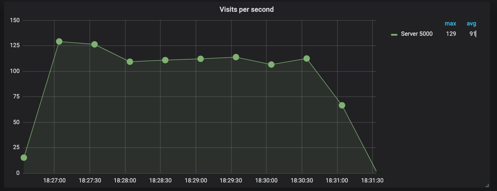

# DevOps: Flask task

### I. Creating Image for app.py

Firstly, we create a folder named <ins>app</ins> which will contain everything, mandatory for the application itself. Besides uploading the code, we also need a corresponding  <ins>Dockerfile</ins> - template, stating the instructions for the consequent container creation. There are some lines we'd like to dive into:

```
RUN pip3.8 install flask
```

We only need a single flask package for the app to be running, since it interrogates with this framework. By the way, pip's version is dictated by the inherited image's version of Python. 

After that several standard lines can be found, mainly focused on establishing a particular working directory and copying there everything vital. Last thing to be mentioned here is the command, being a key part of the entire document. 


```
CMD ["python3", "-m" , "flask", "run", "--host=0.0.0.0"]
```

It orders to run a python3 flask framework with a specific zero host for external visibility control.

### II. Configuration of Prometheus

Prometheus is a well-known monitoring system. This tool will allow us to collect and store target metric for further visualization, being an intermediate phase of the entire deployed architecture. So, we need a specific adjustment for the default configuration. 

```
global:
  scrape_interval: 1s
  rule_files:
```

First parameter is defining the metric's collection interval. The latter is pointless for our task and simply stands for list of files that need to be executed before, available for all the read ones.

After the global section we reach the next one: scrape configurations.

```
scrape_configs:
  - job_name: "prometheus"
    static_configs:
      - targets: ["prometheus:9090"]

  - job_name: "Server 5000"
    static_configs:
      - targets: ["app:5000"]
```

We assign a name for each job and provide a `static_configs` section, where statically set a particular target metric. By the way, the one more intresting for one comes from localhost 5000, being appointed for out application (the second job).

### Dashboard visualization


